<!-- Überblick über Kameraobjektive und Filter -->
<h1 style="color:rgb(47, 178, 143); font-size: 130px;">Überblick</h1>

- Definition von Kameraobjektiven
- Arten von Objektiven
- Wichtige Parameter
- Auswahl des richtigen Objektivs
- Kamerafilter
- Arten von Filtern
- Verwendung von Filtern

---

<h1 style="color:rgb(47, 178, 143); font-size: 110px;">Kameraobjektive</h1>

- Wesentlicher Bestandteil der Fotografie
- Manipuliert das in die Kamera eintretende Licht
- Beeinflusst Bildschärfe, Kontrast, Farbe und Verzerrung

**Vielfalt an Objektiven für unterschiedliche Zwecke**

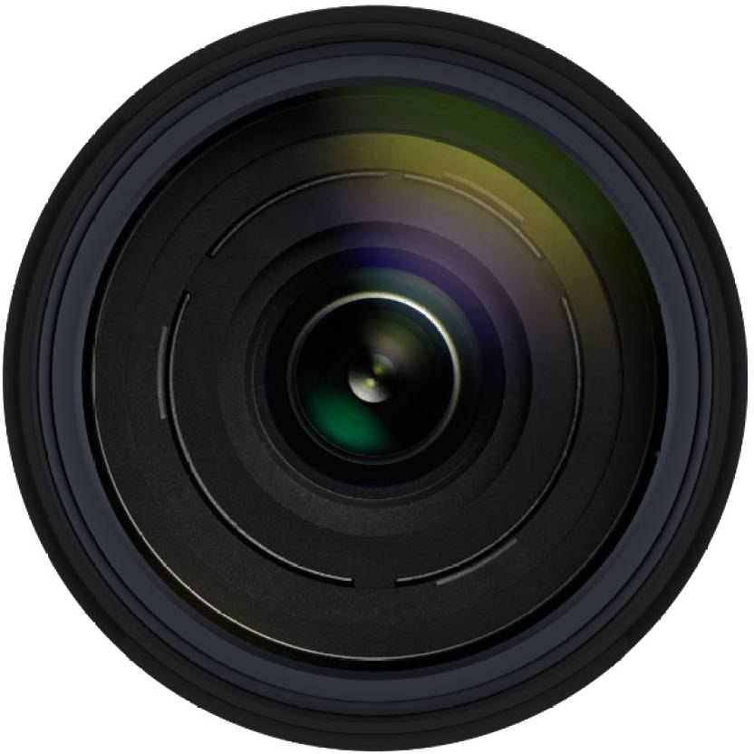
---

<h1 style="color:rgb(47, 178, 143); font-size: 70px;">Arten von Objektiven</h1>

<section>
</section>

<section>

##### Weitwinkelobjektive

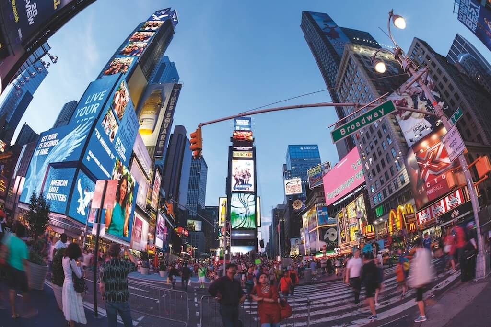

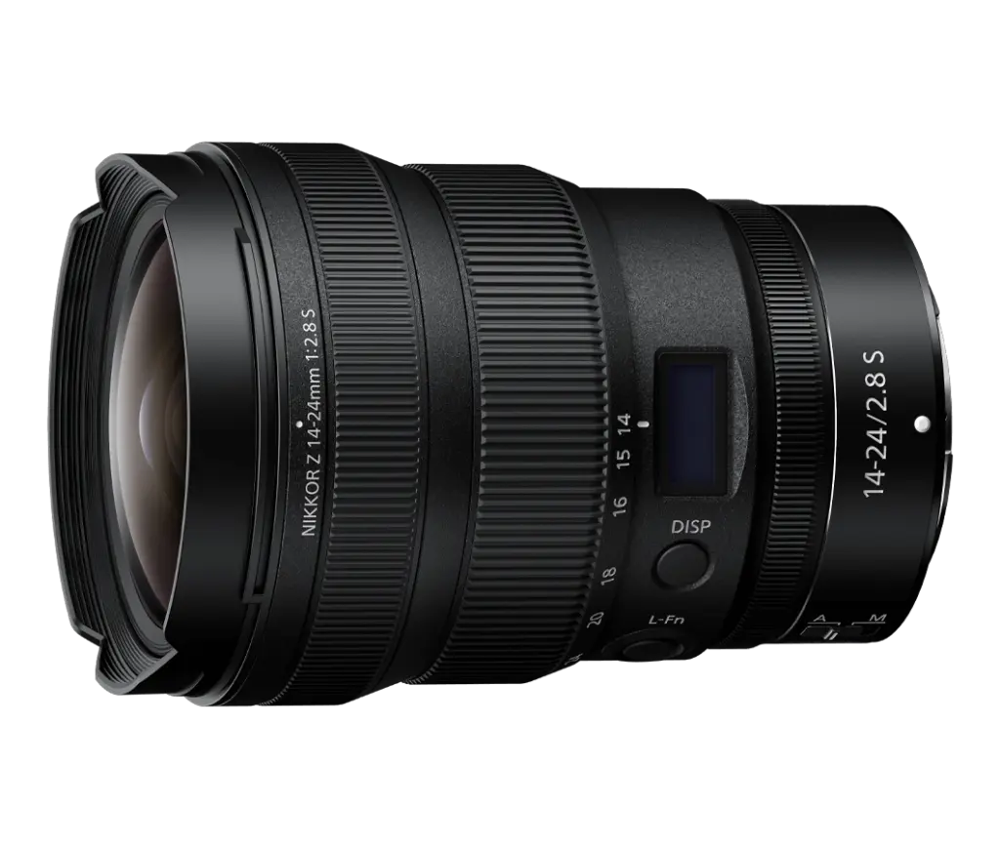
</section>

<section>

##### Standard-/Normalobjektive

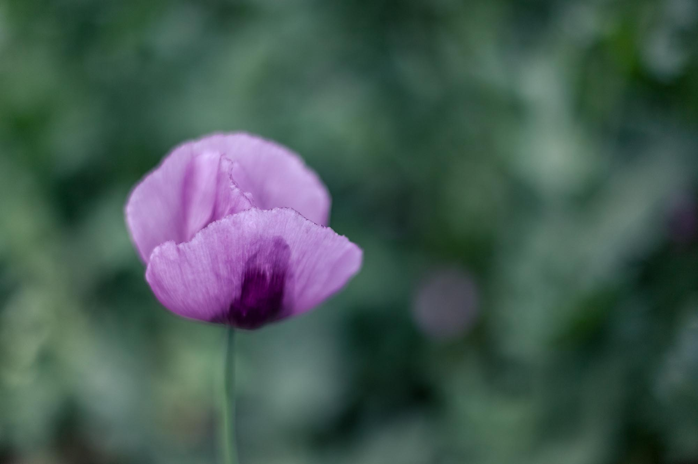

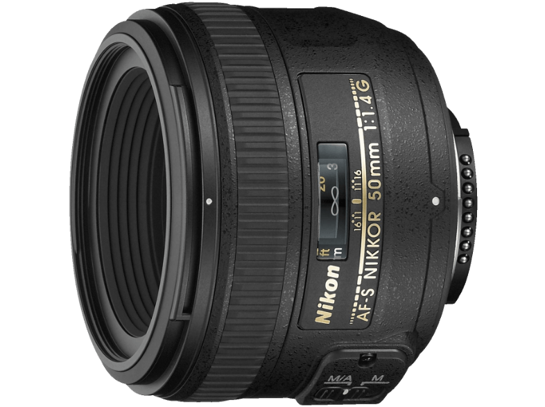
</section>

<section>

##### Teleobjektive 

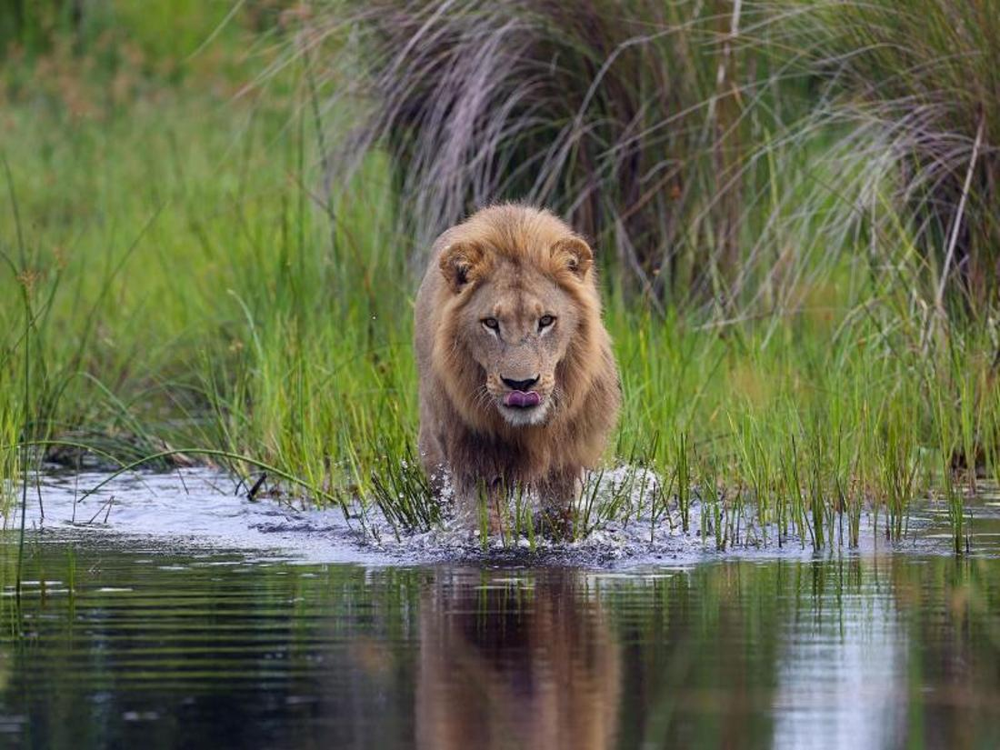

</section>

<section>

##### Zoomobjektive

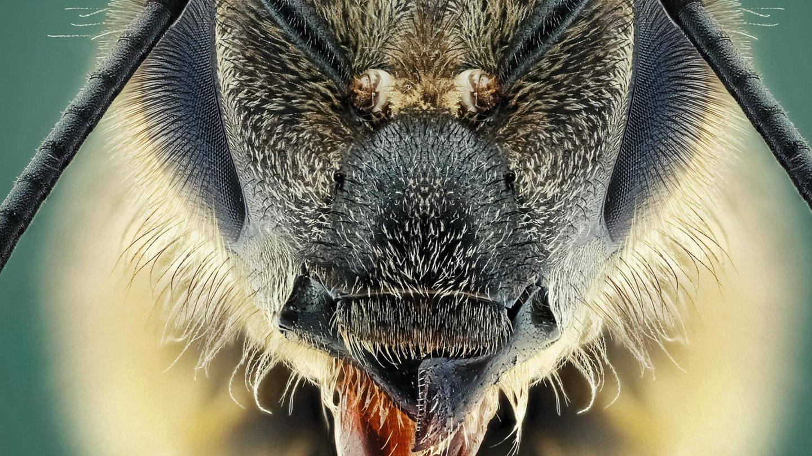

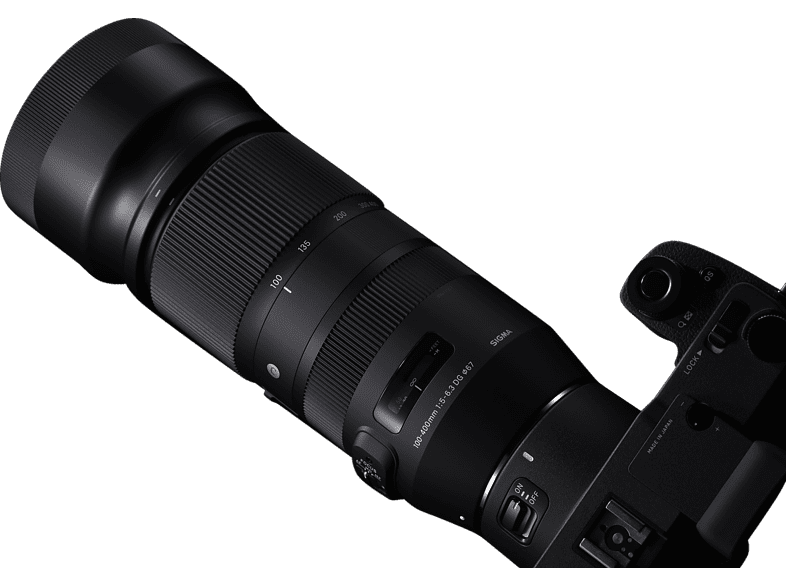
</section>

<section>

##### Spezialobjektive (Makro, Fisheye, Tilt-Shift, etc.)

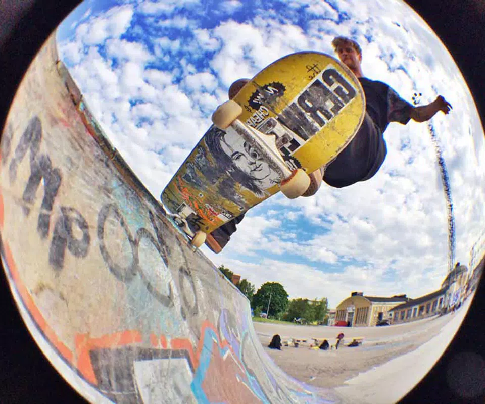
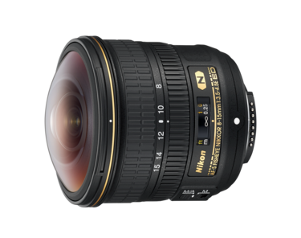
</section>

---

<h1 style="color:rgb(47, 178, 143); font-size: 80px;">Wichtige Parameter</h1>

<section>

- Brennweite
- Blendenöffnung
- Bildstabilisierung
- Autofokus vs. manueller Fokus
</section>

---

<h1 style="color:rgb(47, 178, 143); font-size: 80px;">Auswahl des Objektivs</h1>

- Berücksichtigung des Verwendungszwecks (Porträt, Landschaft, Sport, Makro, etc.)
- Kompatibilität mit der Kamera
- Preis und Qualität

---

<h1 style="color:rgb(47, 178, 143); font-size: 100px;">Kamerafilter</h1>

<section>

- Definition und Funktion
- Warum Filter verwenden?
</section>

---

<h1 style="color:rgb(47, 178, 143); font-size: 70px;">Arten von Kamerafiltern</h1>
<section>
UV-Filter
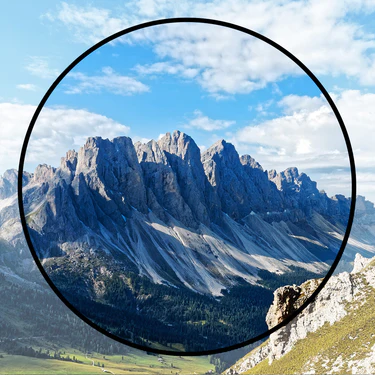
</section>
<section>
Polarisationsfilter
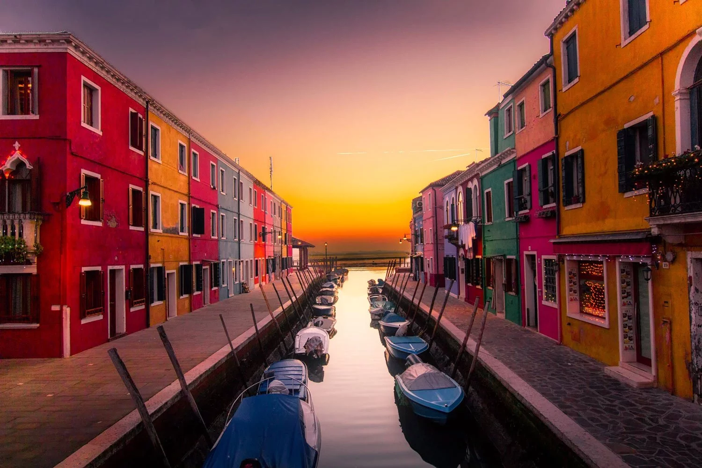
</section>
<section>
Neutraldichte (ND) Filter

</section>
<section>
Verlaufsfilter

</section>
<section>
Spezialeffektfilter (Stern, Weichzeichner, etc.)

</section>
---

<h1 style="color:rgb(47, 178, 143); font-size: 80px;">Verwendung von Filter</h1>

- Auswahl des richtigen Filters für eine bestimmte Aufnahme
- Einfluss des Filters auf die Bildqualität
- Physische vs. digitale Filter