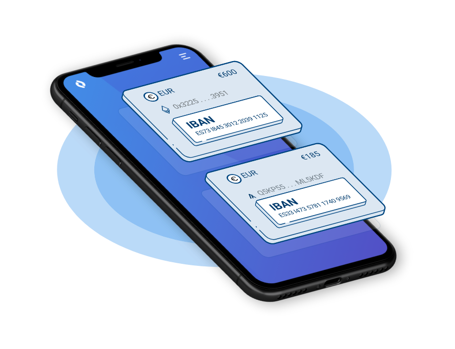
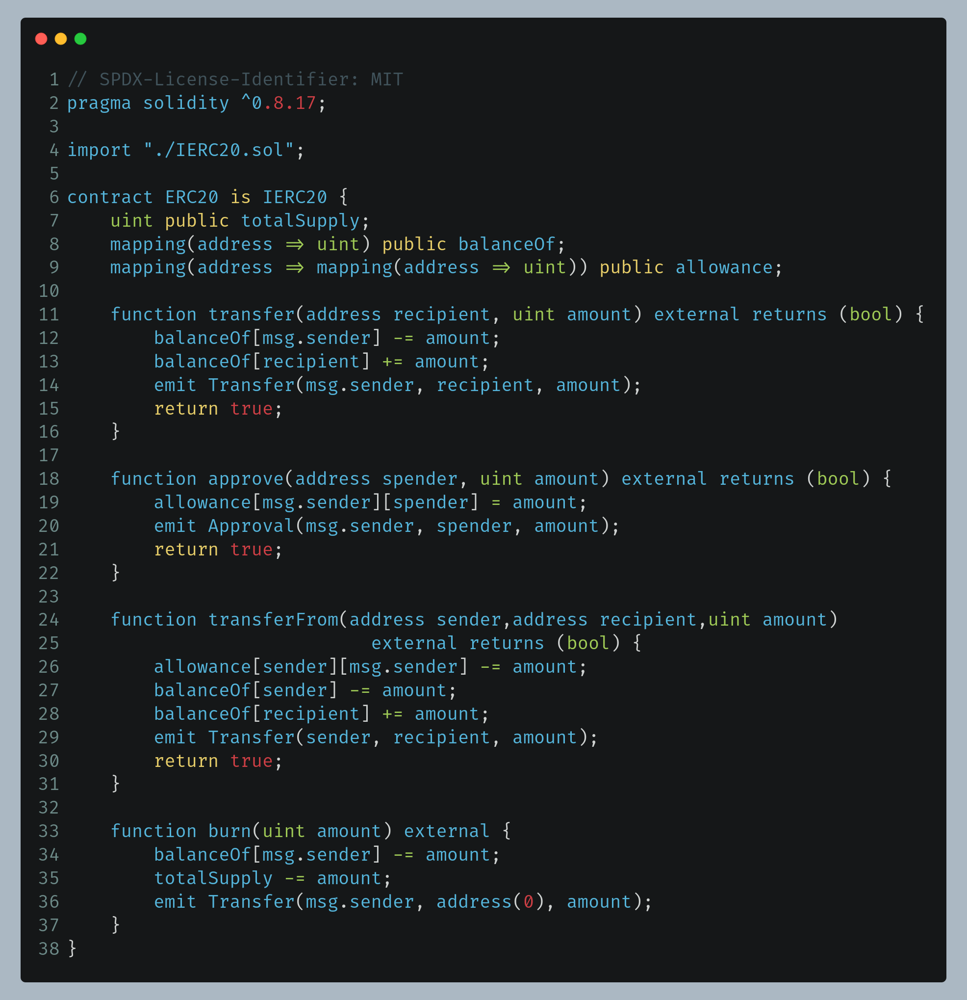

<!-- Overview of Ethereum -->
<h1 style="color:rgb(47, 178, 143); font-size: 130px;">Overview</h1>

- Definition of Ethereum 
- Smart contracts, NFT's
- ERC-20 Tokens
- Ether
- Address

---

<h1 style="color:rgb(47, 178, 143); font-size: 130px;">Ethereum</h1>

- Cryptocurrency
- Programmable (Smart Contracts)
- Create decentralized applications

---

<h1 style="color:rgb(47, 178, 143); font-size: 110px;">Smart Contracts</h1>

<section>
</section>

<section>
Computer programs on blockchain
</section>
<section>
Deployed and executed
</section>
<section>

None Fungible Token (ERC-721)

</section>

<section>

ERC-20 Tokens 

 [Monerium](https://monerium.com)

[Monerium on Etherscan](https://etherscan.io/token/0x3231cb76718cdef2155fc47b5286d82e6eda273f)
</section>

---

---

<h1 style="color:rgb(47, 178, 143); font-size: 80px;">DApps on Ethereum</h1>

<section>
</section>

<section>
Run on the Ethereum blockchain
</section>
<section>
Aave: lending/borrowing platform
</section>
<section>
Uniswap: swap erc-20 tokens
</section>

<section>

[Uniswap](https://app.uniswap.org/#/swap)

</section>

---

<!-- Ethereum's Token, Ether (ETH) -->
<h1 style="color:rgb(47, 178, 143); font-size: 70px;">Ethereum's Token - Ether</h1>

- Ethereum's native cryptocurrency
- Transaction fees
- Deployment of contract

---

<h1 style="color:rgb(47, 178, 143); font-size: 100px;">ETH Adresses</h1>

<section>
</section>

<section>
address space is based on SHA-256
</section>
<section>
0xb3e904a8E2C16f77d13adB3d3622FC31303b656c
</section>
<section>
There are 2^256 eth addresses
</section>

<section>
2^256 = 
115792089237316195423570985008687907853269984665640564039457584007913129639936 keys.
</section>

