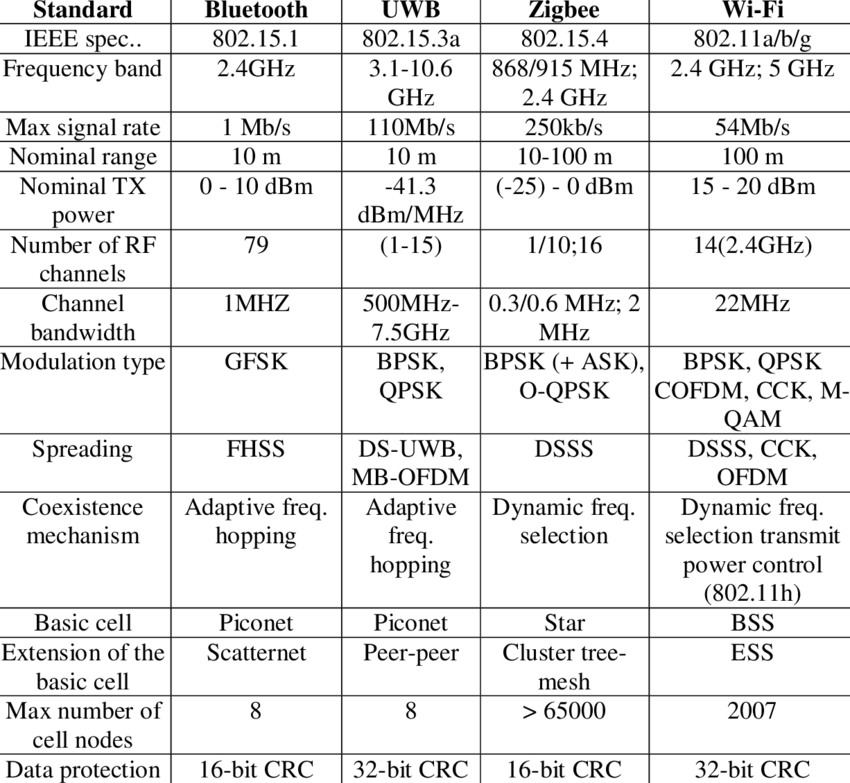

        <h1 style="color:rgb(47, 178, 143); font-size: 90px;">Overview</h1>
        
        1. Definition of **WPAN**
        2. **WPAN** compared to **WLAN**
        3. Usecases
        4. Implementations
        5. Standards
        
        ---
        

        <h1 style="color:rgb(47, 178, 143); font-size: 90px;">Definition of WPAN</h1>

        - subgroup of **Personal Area Network**
        - short range setup
        - the lower transmission power results in energy savings
        - used to connect to a larger network

        ---

        <h1 style="color:rgb(47, 178, 143); font-size: 90px;">WPAN vs WLAN</h1>

        vs | **WPAN** | **WLAN**
        --- | --- | ---
         distance | short | wide
        infrastructure | none | much
        data rates | low | high

        ---
        <h1 style="color:rgb(47, 178, 143); font-size: 90px;">Usecases</h1>

        
        ---

        <h1 style="color:rgb(47, 178, 143); font-size: 90px;">Implementations</h1>

        - Bluetooth / Bluetooth LE
        - Zigbee
        - Infrared
        - RFID
        - NFC
        
        ---

        <h1 style="color:rgb(47, 178, 143); font-size: 80px;">Data Rates and Ranges</h1>

        tech | speed | range
        --- | --- | ---
        BT | 3 Mb/s | up to km
        Zigbee | 250 kbit/s | 100m
        Infrared | 4 Mbit/s | 10m
        RFID | varry | 1000m
        NFC | 424 kbit/s | 10cm
        WLAN | 54 Mbit/s | 100m

        ---

        <h1 style="color:rgb(47, 178, 143); font-size: 52px;">Standards</h1>

        

        ---

        ## Goodbye

        ```javascript
        var s = "JavaScript syntax highlighting";
        alert(s);
        ```