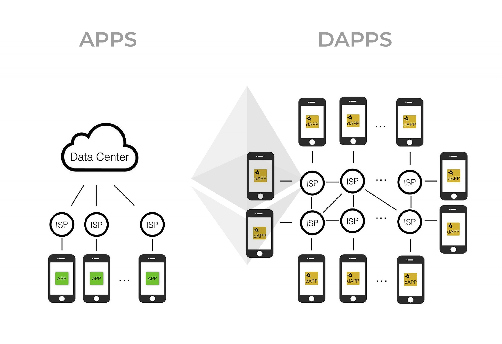

<!-- Overview of Ethereum -->
<h1 style="color:rgb(47, 178, 143); font-size: 130px;">Overview</h1>

- Definition of Ethereum 
- Purpose
- Use cases
- Key features & benefits
- Ethereum / Ether

---

<h1 style="color:rgb(47, 178, 143); font-size: 110px;">Definition</h1>

- Cryptocurrency
- Programmable (Smart Contracts)
- Create decentralized applications

---

<!-- Smart Contracts on Ethereum -->
<h1 style="color:rgb(47, 178, 143); font-size: 110px;">Smart Contracts</h1>

- Explanation of what smart contracts are and how they work on the Ethereum blockchain
- Examples of real-world use cases for smart contracts on Ethereum

---

<!-- Ethereum's Token, Ether (ETH) -->
<h1 style="color:rgb(47, 178, 143); font-size: 100px;">Ethereum's Token, Ether (ETH)</h1>

- Overview of Ethereum's native cryptocurrency, Ether (ETH)
- Use cases for Ether, including as a means of exchange and as a way to pay for transaction fees on the Ethereum network

---

<!-- Decentralized Applications (DApps) on Ethereum -->
<h1 style="color:rgb(47, 178, 143); font-size: 80px;">DApps on Ethereum</h1>

<section>
</section>

<section>

- Explanation of what decentralized applications (DApps) are and how they work on the Ethereum blockchain
- Examples of popular DApps built on Ethereum, such as Uniswap and Aave
</section>

<section>

- Financial deduction, social media, betting platform

</section>

---

<!-- Conclusion -->
<h1 style="color:rgb(47, 178, 143); font-size: 100px;">Conclusion</h1>

- Summary of key takeaways from the presentation
- Final thoughts on the potential of Ethereum and the future of blockchain technology

