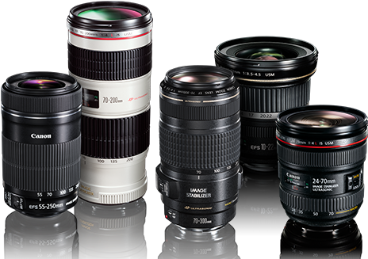
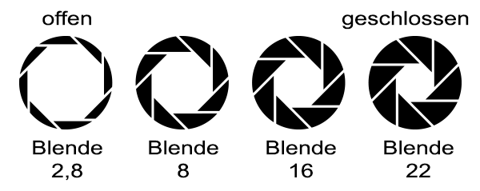
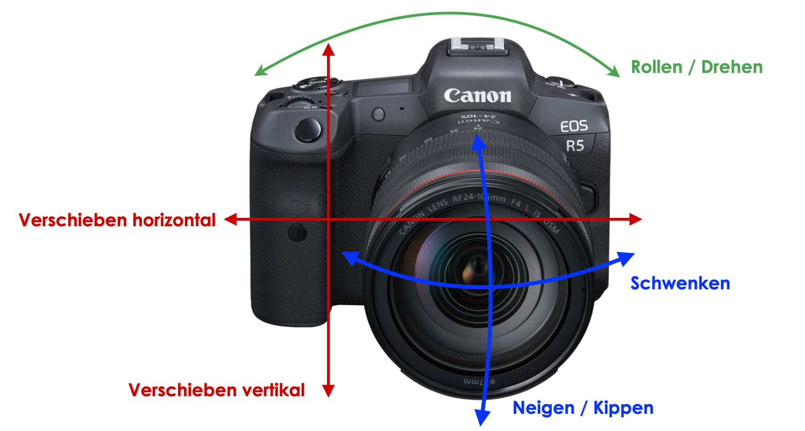
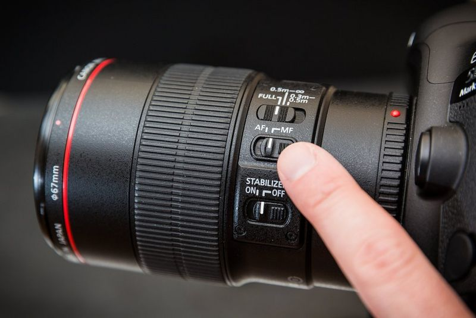
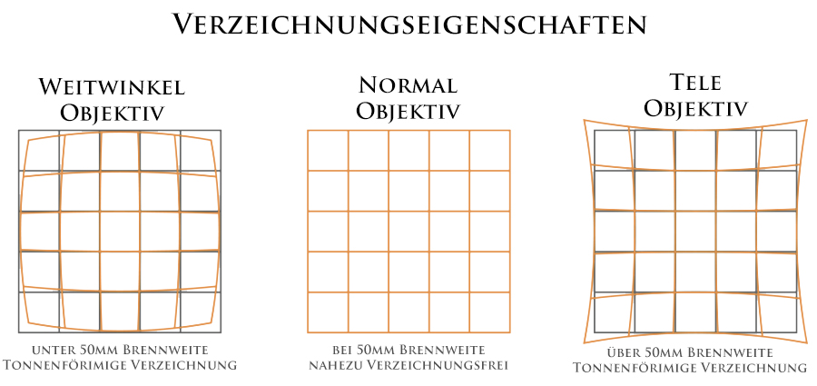
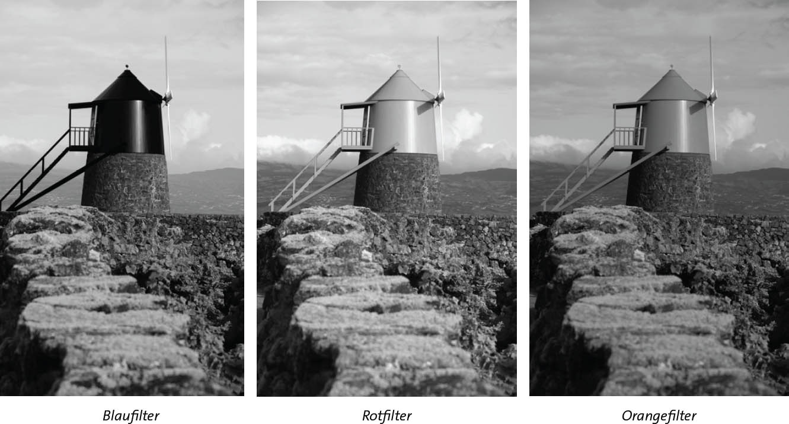
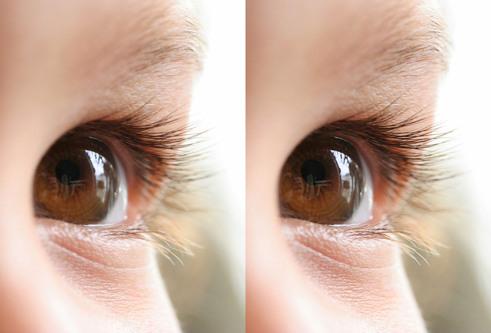
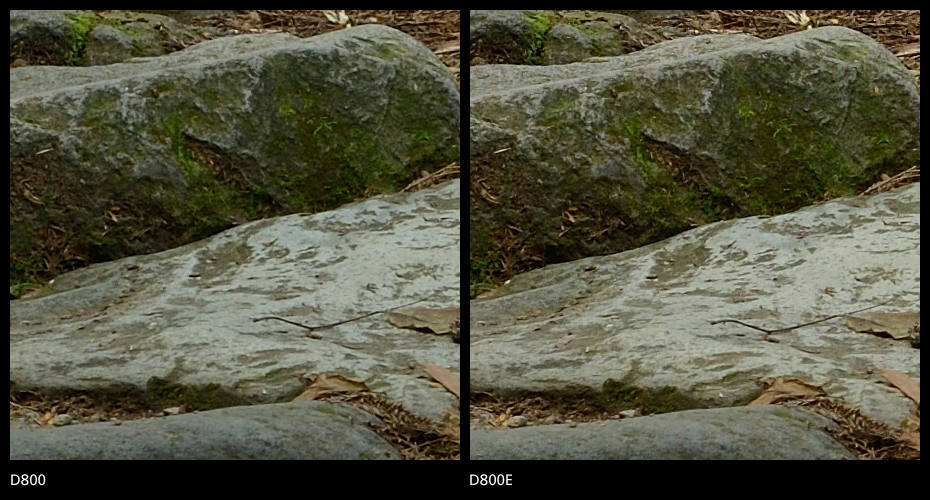
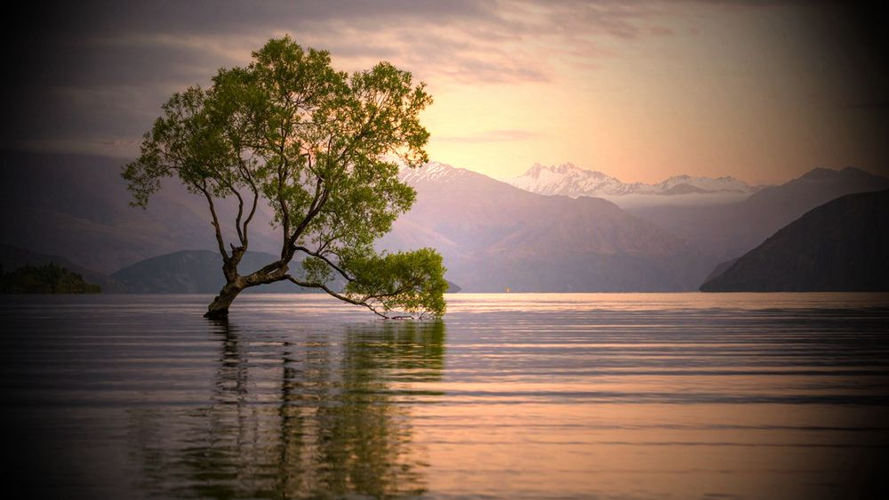

<!-- Überblick über Kameraobjektive und Filter -->
<h1 style="color:rgb(47, 178, 143); font-size: 130px;">Überblick</h1>

<section>
</section>

<section>

- Definition von Kameraobjektiven
- Arten von Objektiven
- Verzerrung
- Wichtige Parameter
- Auswahl des richtigen Objektivs
</section>

<section>

- Kamerafilter
- Arten von Filtern
- Filter in der Bildbearbeitung
- Verwendung von Filtern
</section>

---

<h1 style="color:rgb(47, 178, 143); font-size: 110px;">Kameraobjektive</h1>

<section>
</section>

<section>

Beeinflussen Bildschärfe, Kontrast, Farbe und Verzerrung
  

</section>

<section>

</section>

<section>

</section>

<section>

</section>

<section>

</section>

---

<section>
</section>

<section>
<h1 style="color:rgb(47, 178, 143); font-size: 70px;">Arten von Objektiven</h1>
</section>

<section>

##### Weitwinkelobjektive

</section>

<section>

##### Standard-/Normalobjektive

</section>

<section>

##### Teleobjektive 

</section>

<section>

##### Zoomobjektive

</section>

<section>

##### Spezialobjektive (Makro, Fisheye, Tilt-Shift, etc.)

</section>

---

<h1 style="color:rgb(47, 178, 143); font-size: 110px;">Verzerrung</h1>

---

<h1 style="color:rgb(47, 178, 143); font-size: 80px;">Wichtige Parameter</h1>

<section>

- Brennweite
- Blendenöffnung
- Bildstabilisierung
- Autofokus vs. manueller Fokus
</section>

---

<h1 style="color:rgb(47, 178, 143); font-size: 80px;">Auswahl des Objektivs</h1>

- Berücksichtigung des Verwendungszwecks (Porträt, Landschaft, Sport, Makro, etc.)
- Kompatibilität mit der Kamera
- Preis und Qualität

---

<h1 style="color:rgb(47, 178, 143); font-size: 100px;">Kamerafilter</h1>

<section>

- Definition und Funktion
- Warum Filter verwenden?
</section>

---

<h1 style="color:rgb(47, 178, 143); font-size: 70px;">Arten von Kamerafiltern</h1>
<section>
<h5>
UV-Filter
</h5>

</section>
<section>
<h5>
Polarisationsfilter
</h5>

</section>
<section>
<h5>
Neutraldichte (ND) Filter
</h5>

</section>
<section>
<h5>
Farbfilter
</h5>

</section>
<section>
<h5>
Spezialeffektfilter 
</h5>

</section>
---

<h1 style="color:rgb(47, 178, 143); font-size: 60px;">Filter in der Bildbearbeitung</h1>
<section>
<h5>Hochpassfilter</h5>

</section>
<section>
<h5>Tiefpassfilter</h5>

</section>
<section>
<h5>Selektive Farbfilter</h5>

</section>
<section>
<h5>Vignettierung</h5>

</section>

---

<h1 style="color:rgb(47, 178, 143); font-size: 70px;">Verwendung von Filtern</h1>

- Auswahl des richtigen Filters
- Einfluss des Filters auf die Bildqualität
- Physische vs. digitale Filter