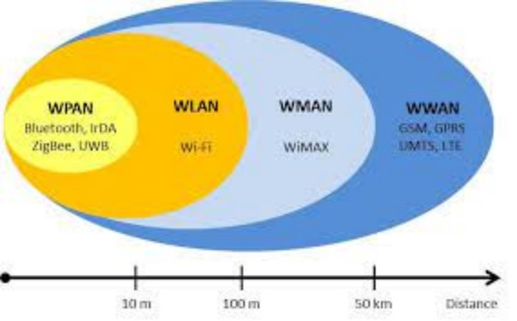
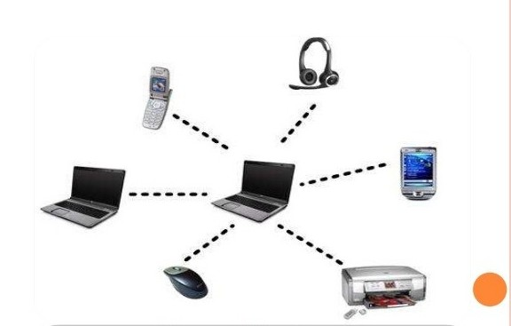
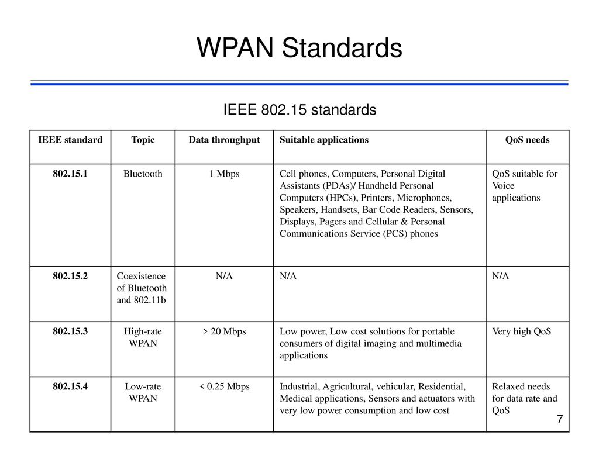

<h1 style="color:rgb(47, 178, 143); font-size: 100px;">Overview</h1>

1. Definition of **WPAN**
2. **WPAN** compared to **WLAN**
3. Usecases
4. Implementations
5. Standards

---

<h1 style="color:rgb(47, 178, 143); font-size: 90px;">Definition of WPAN</h1>

- subgroup of **Personal Area Network**
- short range setup
- the lower transmission power results in energy savings
- used to connect to a larger network

---

<h1 style="color:rgb(47, 178, 143); font-size: 100px;">WPAN vs WLAN</h1>

| vs             | **WPAN** | **WLAN** |
| -------------- | -------- | -------- |
| distance       | short    | wide     |
| infrastructure | none     | much     |
| data rates     | low      | high     |

---

---

<h1 style="color:rgb(47, 178, 143); font-size: 90px;">Usecases</h1>

## 

---

<h1 style="color:rgb(47, 178, 143); font-size: 90px;">Usecases</h1>

## 

---

---

<h1 style="color:rgb(47, 178, 143); font-size: 90px;">Implementations</h1>

- Bluetooth / Bluetooth LE
- Zigbee
- Infrared
- RFID
- NFC

---

<h1 style="color:rgb(47, 178, 143); font-size: 80px;">Data Rates and Ranges</h1>

| tech     | speed        | range      |
| -------- | ------------ | ---------- |
| BT       | _3 Mb/s_     | _up to km_ |
| Zigbee   | _250 kbit/s_ | _100m_     |
| Infrared | _4 Mbit/s_   | _10m_      |
| RFID     | _8 kbit/s_   | _1000m_    |
| NFC      | _424 kbit/s_ | _10cm_     |
| WLAN     | _54 Mbit/s_  | _100m_     |
        

---

## 👋 Let's discuss!

