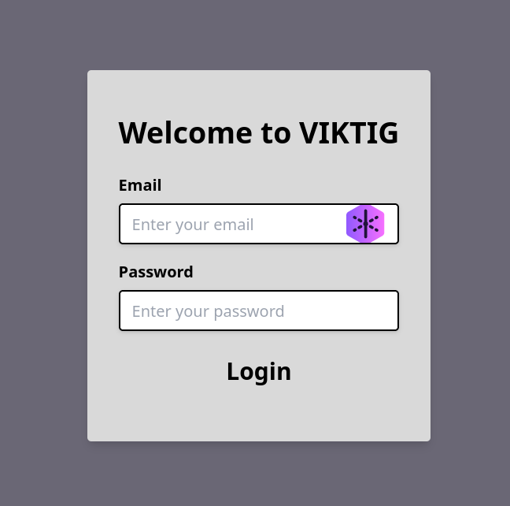

<h1 style="color:#a9e8d2; font-size: 70px;">Digitale Ära & Echtzeitkommunikation</h1>

<section>
</section>

<section>
Unverzichtbare Bedeutung in der heutigen Zeit
</section>

<section>
Zügiger Informationsaustausch zwischen Schülern und Lehrern
</section>

<section>
Marktdominanz durch große Unternehmen
</section>

<section>
Amerikanische Firmen mit proprietärer Software
</section>

<section>
WhatsApp, Telegram, Discord
</section>

---

<h1 style="color:#a9e8d2; font-size: 80px;">Technologie</h1>

<section>
</section>

<section>
Relevante Alternative zu bestehenden Lösungen
</section>

<section>
Performance auf hohem Niveau
</section>
<section>
Hohe Sicherheitsstandards
</section>

<section>
Zeitgemäßes und benutzerfreundliches Design
</section>

<section>
Einsatz neuester Technologien
</section>

<section>
Zukunftsichere Lösung
</section>

---

<h1 style="color:#a9e8d2; font-size: 70px;">Überblick</h1>

- design
- user authentication
- session context
- endpoints
- realtime socketio
- datenbank

---

<h1 style="color:#a9e8d2; font-size: 150px;">Frontend</h1>

---

---

## Design

 

    

        
    

    <ul style="width: 80%;" >
      <li style="margin-bottom:10px">Ansprechendes modernes Design.</li>
        <li style="margin-bottom:10px">Ermutigt effiziente Kommunikation.</li>
        <li style="margin-bottom:10px">Responsive und Layouts. </li>
        <li style="margin-bottom:10px">Prototypen in Figma erstellt</li>
    </ul>

---

### Login

    <ul style="width: 70%;" >
        <li>Email + Passwort</li>
         
        <li>Globaler sessionContext</li>
         
        <li>Error handling</li>
         
    </ul>
    

        
    

---
### Chat

    

        
    

    <ul style="width: 70%;" >
        <li>Live Update</li>
         
        <li>Funktionaler Input</li>
         
        <li>Dynamische Images</li>
         
    </ul>

---

### Navigation

    <ul style="width: 70%;" >
        <li>Guppen und Direkt</li>
         
        <li>Funktionsbutton</li>
         
        <li>New Chat Funktion</li>
         
    </ul>
    

        
        
    

---

### Profile

    

        
    

    <ul style="width: 70%;" >
        <li>Profilbild  ändern</li>
         
        <li>Passwort ändern</li>
         
        <li>Andere Profile einsehen</li>
         
    </ul>

---

---

<h1 style="color:#a9e8d2; font-size: 160px;">Backend</h1>

---

## Daten Management

    

        
    

    <ul style="width: 80%;" >
      <li style="margin-bottom:10px">Daten werden aus JSON-Datei eingelesen</li>
        <li style="margin-bottom:10px">Passwörter werden gehasht</li>
    </ul>

---
### Benutzerauthentifizierung

<section>
</section>
<section>

</section>

<section>

<ul style="width: 80%;" >
    <li style="margin-bottom:10px">Authentifizierungsstatus & Benutzerinformationen</li>
    <li style="margin-bottom:10px">express-session als middleware</li>
    <li style="margin-bottom:10px">Session-Daten serverseitig gespeichert</li>
</ul>
</section>

<section>
<video style="height: 800px; width: 900px;" data-autoplay src="./images/demonstrate_session.mp4"></video>
</section>

---

## Endpoints

 
<ul style="width: 80%;" >
<li style="margin-bottom:10px">Frontend sendet Anfragen</li>
<li style="margin-bottom:10px">Backend als RESTful API</li>
<li style="margin-bottom:10px">Einfache Erweiterung und Skalierung der Applikation</li>
</ul>

---

## Socket.io

    

        
    

Socket.io informiert Teilnehmer

---

## Datenbank

    

        
    

    <ul style="width: 80%;" >
      <li style="margin-bottom:10px">Robustes relationales Datenbankmanagementsystem</li>
      <li style="margin-bottom:10px">Sichere Speicherung von Benutzerdaten und Nachrichten</li>
      <li style="margin-bottom:10px">Gewährleistung von Datenkonsistenz und Zuverlässigkeit</li>
    </ul>

<!-- <h1 style="color:rgb(47, 178, 143); font-size: 60px;">Zusammenfassung</h1>

<section>
    <ul>
        <li>Umfassendes schulisches Kommunikationsnetzwerk</li>
        <li>Benutzerzentriertes Design</li>
        <li>Robuste Authentifizierung</li>
        <li>Effizientes Sitzungsmanagement</li>
        <li>Klare Endpunkte</li>
        <li>Skalierbare Plattform</li>
    </ul>
</section> -->
